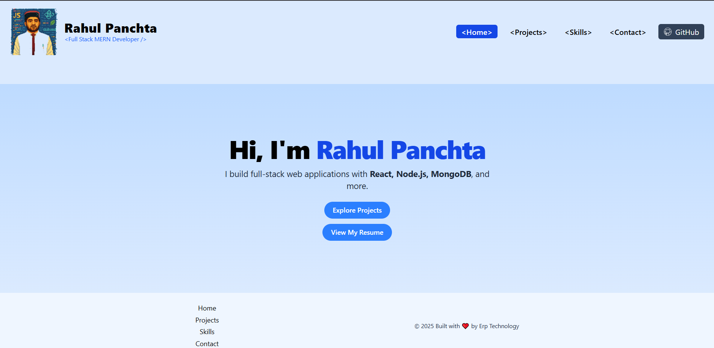

# 🌐 Rahul Panchta - Full Stack MERN Developer Portfolio

Welcome to my personal portfolio website built using **React**, **Tailwind CSS**, and powered by a **MongoDB + Express** backend. This site showcases my skills, projects, and allows visitors to contact me through a dynamic form.

---

## 🚀 Live Demo

🌍 [View Live Website](https://your-live-portfolio-link.com)

---

## 📸 Preview

---

## ✨ Features

- 💼 Project showcase with GitHub links
- 📜 Resume download
- 📧 Contact form with toast notification + MongoDB storage
- 🔥 Responsive design (mobile-first)
- 🌐 SEO optimized with Open Graph meta tags
- ⚙️ Full Stack using MERN

---

## 🛠 Tech Stack

### Frontend
- React
- Tailwind CSS
- React Hook Form + Toastify
- React Router v6

### Backend
- Node.js
- Express
- MongoDB
- CORS / dotenv

---

## 📁 Folder Structure
my-portfolio/ ├── backend/ │ ├── server.js │ ├── public/ │ ├── favicon.ico │ └── preview.png ├── src/ │ ├── pages/ │ ├── components/ │ ├── App.jsx │ └── index.css / main.jsx 
